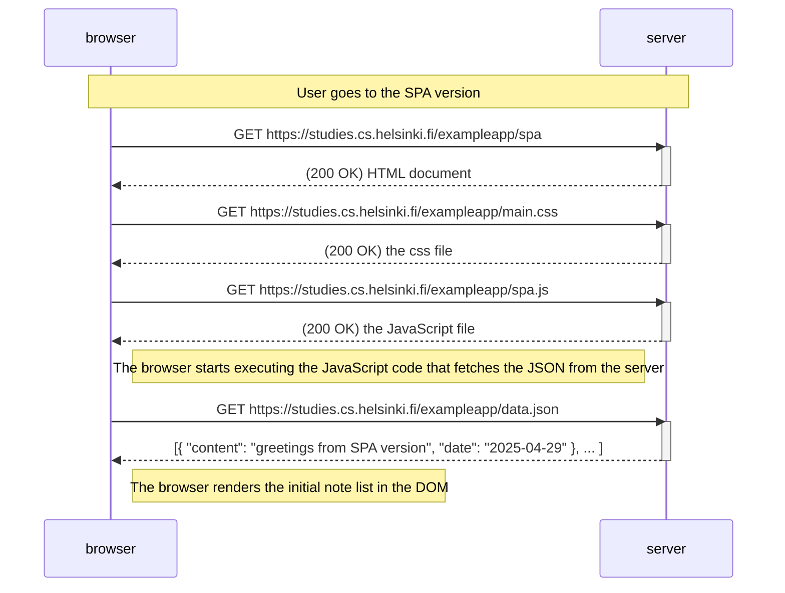

```mermaid:
sequenceDiagram
    participant browser
    participant server

    Note over browser,server: User goes to the SPA version

    browser->>server: GET https://studies.cs.helsinki.fi/exampleapp/spa
    activate server
    server-->>browser: (200 OK) HTML document
    deactivate server

    browser->>server: GET https://studies.cs.helsinki.fi/exampleapp/main.css
    activate server
    server-->>browser: (200 OK) the css file
    deactivate server

    browser->>server: GET https://studies.cs.helsinki.fi/exampleapp/spa.js
    activate server
    server-->>browser: (200 OK) the JavaScript file
    deactivate server

    Note right of browser: The browser starts executing the JavaScript code that fetches the JSON from the server

    browser->>server: GET https://studies.cs.helsinki.fi/exampleapp/data.json
    activate server
    server-->>browser: [{ "content": "greetings from SPA version", "date": "2025-04-29" }, ... ]
    deactivate server

    Note right of browser: The browser renders the initial note list in the DOM

```
